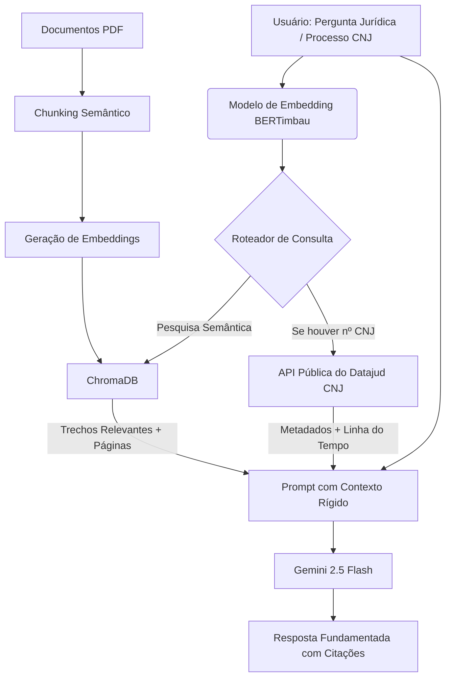

<div align="center">
  
  <h1>🌳 Projeto Jequitibá</h1>
  <p>
    <b>Assistente Jurídico Inteligente Baseado em RAG e LLMs.</b>
  </p>

  <p>
    <a href="#-sobre-o-projeto">Sobre o Projeto</a> •
    <a href="#-o-simbolismo-do-jequitibá">O Simbolismo</a> •
    <a href="#-arquitetura-do-sistema">Arquitetura</a> •
    <a href="#-estrutura-do-repositório">Estrutura</a> •
    <a href="#-tech-stack">Tech Stack</a>
  </p>

  
  
  
  
  
</div>

---

## ⚖️ Sobre o Projeto

O **Projeto Jequitibá** é uma iniciativa de pesquisa desenvolvida no âmbito do Mestrado do Instituto de Ciências Matemáticas e de Computação (ICMC-USP), dedicada à aplicação de Inteligência Artificial para análise e interpretação de documentos jurídicos complexos. Seu principal produto é o **Legal RAG Assistant (LRA)**, um assistente jurídico contextual baseado em técnicas de Retrieval-Augmented Generation (RAG) e Grandes Modelos de Linguagem (LLMs).

A solução foi concebida para enfrentar dois dos principais desafios atuais da aplicação de LLMs ao domínio jurídico: a ocorrência de alucinações e as limitações de contexto ao analisar grandes volumes documentais. Para isso, utiliza uma arquitetura baseada em RAG, na qual contratos, pareceres e outros documentos jurídicos são processados, segmentados em trechos semanticamente coerentes e armazenados em um banco vetorial. 

Adicionalmente, o sistema conta com integração nativa com a **API Pública do Datajud (CNJ)**. Quando uma consulta é realizada, se o usuário citar o número de um processo judicial unificado, o sistema busca os metadados e o andamento processual em tempo real na base nacional, agregando essas informações como contexto dinâmico para a IA.

---

## 🌳 O Simbolismo do Jequitibá

O nome **Jequitibá** foi escolhido por representar valores fundamentais para o domínio jurídico e para a própria proposta tecnológica do projeto. Considerado uma das maiores e mais longevas árvores nativas do Brasil, o jequitibá simboliza solidez, confiabilidade, permanência e acúmulo de conhecimento ao longo do tempo. 

Assim como suas raízes profundas sustentam uma estrutura robusta por séculos, o Projeto Jequitibá busca fundamentar suas respostas em evidências documentais concretas, preservando a rastreabilidade das informações e reduzindo os riscos associados à geração de conteúdo não fundamentado.

Tal como a árvore que lhe dá nome, o sistema pretende servir como uma estrutura confiável, duradoura e fundamentada para apoiar a tomada de decisão e a análise documental no contexto jurídico.

---

## 🏗️ Arquitetura do Sistema

A arquitetura do sistema segue um fluxo estruturado de ingestão, indexação, recuperação e geração de conhecimento:

1. **Ingestão:** Documentos jurídicos em formato PDF são processados e divididos em fragmentos semanticamente coerentes (chunks) usando divisores recursivos para preservar o contexto de cláusulas.
2. **Embedding:** Esses fragmentos são convertidos em representações vetoriais por meio de modelos de embeddings (BERTimbau base em português).
3. **Indexação/Vector Store:** Armazenamento dos embeddings em um banco vetorial local (ChromaDB) usando similaridade de cosseno para garantir scores de relevância precisos e normalizados entre 0 e 1.
4. **Roteamento de Consulta (Datajud):** Se o usuário incluir um número CNJ de 20 dígitos na pergunta, o roteador consulta a API Pública do Datajud (CNJ), identificando o tribunal de origem automaticamente (TRFs, TRTs, TREs, TJs estaduais ou TJMs) e extraindo a última linha do tempo de movimentações processuais.
5. **Recuperação e Geração:** O modelo de linguagem (Gemini) recebe a união do contexto vetorial recuperado do ChromaDB e os metadados em tempo real do Datajud para gerar respostas estritamente fundamentadas, indicando precisamente as fontes e páginas consultadas.



---

## 📂 Estrutura do Repositório

```
/legal-rag-assistant
│
├── /data
│   ├── /raw_contracts       # PDFs de exemplo (Anonimizados)
│   └── /vector_store        # Banco de dados vetorial persistido (ChromaDB)
│
├── /src
│   ├── ingest.py            # Script de Chunking e Embedding (BERTimbau)
│   ├── rag_engine.py        # Lógica de Retrieval e Integração RAG (Gemini)
│   ├── prompts.py           # Templates de Prompt (Engenharia de Prompt)
│   └── datajud_client.py    # Cliente de Integração com a API Pública do Datajud (CNJ)
│
├── /app
│   └── streamlit_app.py     # Interface de Chat e Consulta com Material Design (Streamlit)
│
├── /scratch
│   ├── create_synthetic_pdf.py  # Gerador de PDF de teste
│   ├── test_pipeline.py         # Teste básico de RAG
│   └── test_datajud.py          # Teste integrado da API Datajud
│
├── .env.example             # Exemplo de configuração (Chaves de API)
├── requirements.txt
└── README.md
```

---

## 🛡️ Salvaguardas contra Alucinação (Prompt Engineering)
Para garantir a confiabilidade exigida por profissionais do direito:
- **Token "Não Encontrei":** O modelo é explicitamente instruído a recusar respostas se o contexto recuperado não for suficiente, em vez de criar informações.
- **Rastreabilidade de Fontes:** Retorno obrigatório de metadados como número da página, nome do documento ou cabeçalho do processo (Datajud) para auditoria humana.
- **Temperatura Zero:** Configuração para geração estritamente determinística das respostas.

---

## 🛠️ Tech Stack

- **Orquestração:** LangChain
- **LLM Base:** Google Gemini (via SDK `google-genai`)
- **Ajuste Fino:** PEFT / LoRA para especialização em linguagem jurídica brasileira, extração de entidades e geração de relatórios de auditoria documental.
- **Consulta Externa:** API Pública do Datajud (CNJ)
- **Vector Database:** ChromaDB (persistência local usando Cosine Similarity)
- **Interface:** Streamlit ( estilizada com fonte Google Fonts *Outfit* e *Material Symbols*)
- **Embeddings:** BERTimbau (`neuralmind/bert-base-portuguese-cased`) via HuggingFace

---

## 👤 Autor

**Fernando Torres**  
Mestrando em Ciência da Computação (ICMC - USP) | Cientista de Dados Sênior  
[LinkedIn](https://www.linkedin.com/in/fertorresfs/)
